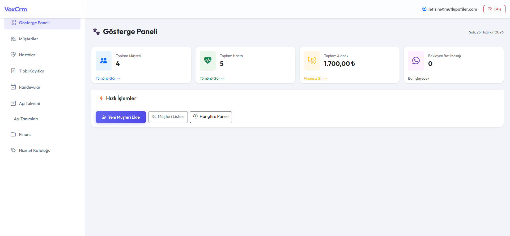
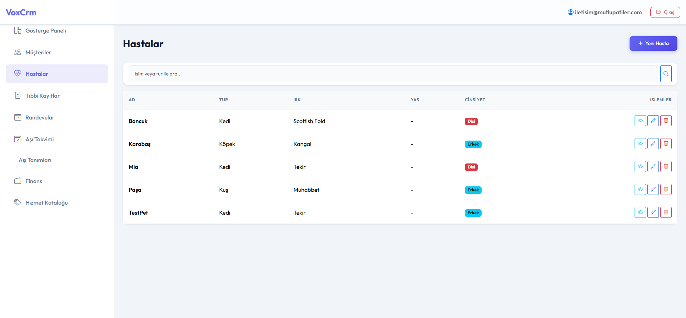
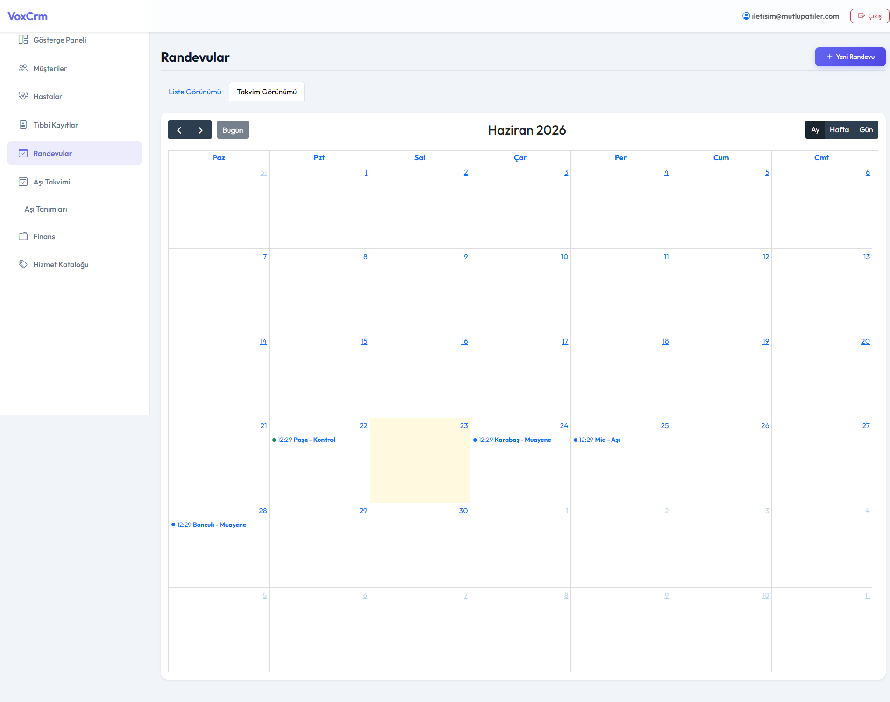
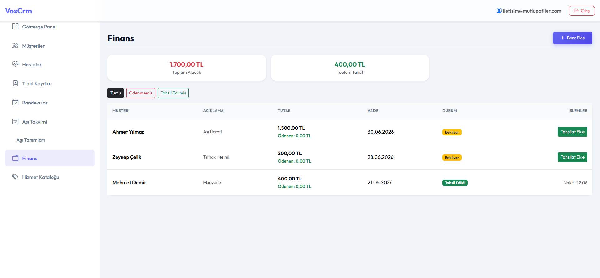

# VoxCRM - Modern Veteriner Klinik Yönetim Sistemi

VoxCRM, veteriner kliniklerinin günlük operasyonlarını dijitalleştirmek, hızlandırmak ve hatasız hale getirmek için tasarlanmış, çoklu-kiracı (multi-tenant) mimarisiyle geliştirilmiş yeni nesil bir web uygulamasıdır.
Ve tabii ki frontend yapmaya şuan vaktim olmadığı için ai ile yaptım ama yakında düzelticem :D 

> **Not:** Proje hala yapım aşamasındadır (Work in Progress). Temel işlevler tamamlanmış olmakla birlikte, aşağıdaki geliştirmeler henüz eklenmemiştir:
> - [ ] Kapsamlı Frontend Refactor (Arayüz iyileştirmeleri)
> - [ ] WhatsApp Bot Entegrasyonu (WP Bot)

## Projenin Amacı ve Hedef Kitlesi
**Amacı:** Veteriner hekimlerin randevu takibi, hasta-sahip ilişkisi yönetimi, tıbbi kayıt (SOAP) tutma, aşılama ve finansal (tahsilat/ödeme) süreçlerini tek bir platform üzerinden, modern ve kullanıcı dostu bir arayüzle yürütebilmesini sağlamaktır.
**Kimlere Uygun?** Küçük, orta veya büyük ölçekli tüm veteriner klinikleri ile hayvan hastaneleri.

## Ekran Görüntüleri

*Arayüz görselleri:*





## Teknik Kapsam ve Kullanılan Teknolojiler
- **Backend:** .NET 10.0, ASP.NET Core MVC
- **Veritabanı:** PostgreSQL (Entity Framework Core)
- **Güvenlik:** ASP.NET Core Identity (Kimlik doğrulama), Global Query Filters (Multi-tenant izolasyonu için ClinicID bazlı veri ayrımı), CSRF ve XSS koruması.
- **Arka Plan İşleri (Background Jobs):** Hangfire (Aşı ve randevu hatırlatmalarının günlük olarak arka planda çalıştırılması).
- **Frontend / Arayüz:** Bootstrap 5, Bootstrap Icons, FullCalendar.js (Randevu yönetimi için), özel Vanilla CSS ve interaktif bileşenler.
- **Mimari:** Clean Architecture prensiplerine yakın; Domain (Varlıklar), Infrastructure (Veri erişimi/EF Core), ve Web (MVC Arayüzü) şeklinde ayrılmış proje yapısı.

## Kurulum Talimatları

1. **Gereksinimler:**
   - .NET 10.0 SDK
   - PostgreSQL Veritabanı Sunucusu

2. **Veritabanı Ayarları:**
   `VoxCrm.Web` klasöründeki `appsettings.json` dosyasını açın ve `DefaultConnection` kısmını kendi PostgreSQL bilgilerinize göre güncelleyin.

3. **Veritabanını Oluşturma (Migration):**
   Proje dizininde (veya Visual Studio Paket Yöneticisi Konsolunda) aşağıdaki komutları çalıştırarak veritabanı tablolarını ayağa kaldırın:
   ```bash
   dotnet ef database update --project VoxCrm.Infrastructure --startup-project VoxCrm.Web
   ```

4. **Uygulamayı Başlatma:**
   ```bash
   cd VoxCrm.Web
   dotnet run
   ```
   Uygulama `http://localhost:5114` adresinde çalışmaya başlayacaktır.

---

## Karşılaşılan Hatalar ve Çözümler

Bu projeyi sıfırdan inşa ederken birçok teknik zorlukla karşılaştık ve bunları modern mühendislik pratikleriyle aştık:

### 1. Multi-Tenant (Çoklu-Kiracı) İzolasyonu ve 404 Hataları
**Sorun:** Sistemi birden fazla kliniğin aynı anda kullanabilmesi için her verinin `ClinicID`'ye bağlı olması gerekiyordu. Ancak yeni bir hasta veya müşteri oluşturduğumuzda, EF Core bu kayda ClinicID'yi otomatik atamadığı için, hemen ardından yönlendirilen detay sayfasında veri "güvenlik filtresine (HasQueryFilter) takılarak" 404 (Bulunamadı) hatası veriyordu.
**Çözüm:** `VoxCrmDbContext` sınıfı içerisindeki `SaveChangesAsync` metodu *override* (ezildi) edildi. Kaydedilen her yeni varlığın (`ITenantEntity` implemente eden) `ClinicID`'si, o an sisteme giriş yapmış olan kullanıcının kimliğinden (Claim'lerinden) otomatik olarak okunarak arka planda sessizce eklendi. Sorun kökten çözüldü.

### 2. Hasta ve Sahip Arasındaki Çift Yönlü Karmaşık İlişkiler (Many-to-Many)
**Sorun:** Bir hastanın birden fazla sahibi, bir müşterinin de birden fazla hastası (hayvanı) olabiliyordu. Sadece hayvan üzerinden sahip eklemek yetmiyor; kliniğe gelen müşterinin sayfasına girip oradan da hayvan eklenebilmesi veya silinebilmesi gerekiyordu.
**Çözüm:** `PatientOwner` ara tablosu kullanılarak N:N ilişkisi kuruldu. Hem `PetOwnerController` hem de `PatientController` üzerine, mevcut bağımsız kayıtları dropdown (seçim) listesinden seçip birbiriyle eşleştiren ve "Bağı Kopar" diyerek bu ara tablodaki veriyi silen simetrik algoritmalar yazıldı.

### 3. Hangfire ile PostgreSQL Kilitlenme (Lock) Sorunu
**Sorun:** Aşı hatırlatmaları için Hangfire kurulumu yapıldığında PostgreSQL üzerinde *“Timeout expired. The timeout elapsed prior to obtaining a distributed lock on the 'hangfire:lock...' resource”* hatası alındı. Veritabanı, eski kilitleri (lock) serbest bırakmıyordu.
**Çözüm:** Veritabanına doğrudan bağlanılıp Hangfire'ın sıkışmış olan `hangfire.lock` tablosundaki kilitler temizlendi ve background servislerinin pürüzsüz çalışması sağlandı.

### 4. Finans Modülünde Parçalı Tahsilat Mantığı
**Sorun:** Bir kliniğin kestiği faturanın bir kısmı peşin, kalanı daha sonra ödenebilirdi. Sadece "Ödendi/Ödenmedi" mantığı veterinerlik iş akışına uygun değildi.
**Çözüm:** Sisteme `Payments` (Ödemeler) tablosu eklendi. Her bir borç kaydı için çoklu tahsilat yapılabilmesi sağlandı. Toplam ödenen tutar, faturanın tutarına ulaştığında sistem borcu otomatik olarak `IsCollected = true` durumuna geçirip yeşil bar ile işaretleyecek şekilde dinamik hale getirildi.

### 5. Kullanıcı Arayüzü (UI) ve Güvenlik Revizyonları
**Sorun:** Web sayfasında amatör duran emojiler ve kodun arkasında göz yoran "AI slop" olarak tabir edilen gereksiz yorum satırları mevcuttu.
**Çözüm:** Tüm arayüz detaylıca tarandı; emojiler silinip tamamen profesyonel Bootstrap Icon kütüphanesine geçirildi. Kodun backend tarafı ise OWASP Top 10 standartlarına göre denetlendi, güvenlik notları dışındaki tüm lüzumsuz metinler temizlenerek kod temizliği (Clean Code) standartlarına ulaşıldı.

---
*VoxCRM, yenilikçi veteriner hekimlerin gücüne güç katmak için büyük bir titizlikle kodlanmıştır.*
