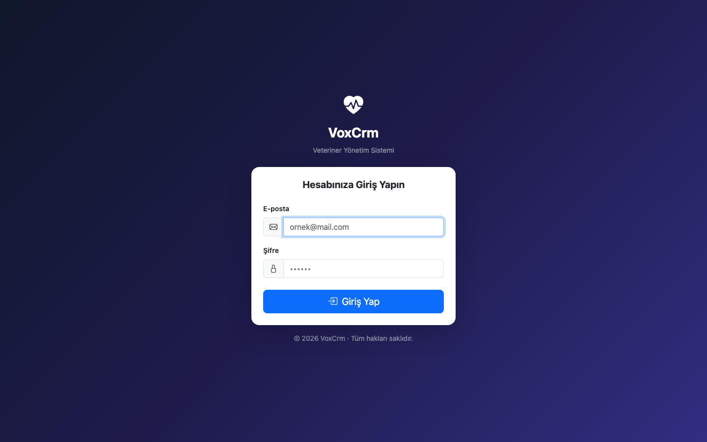
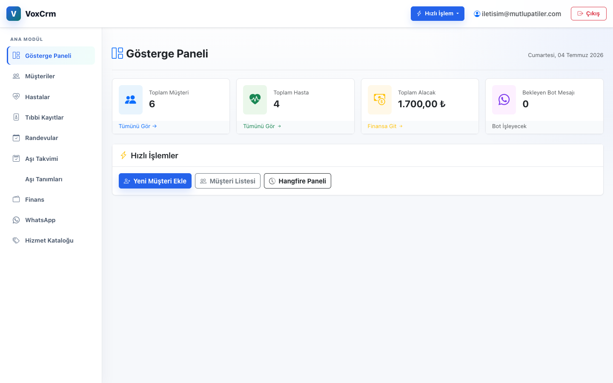
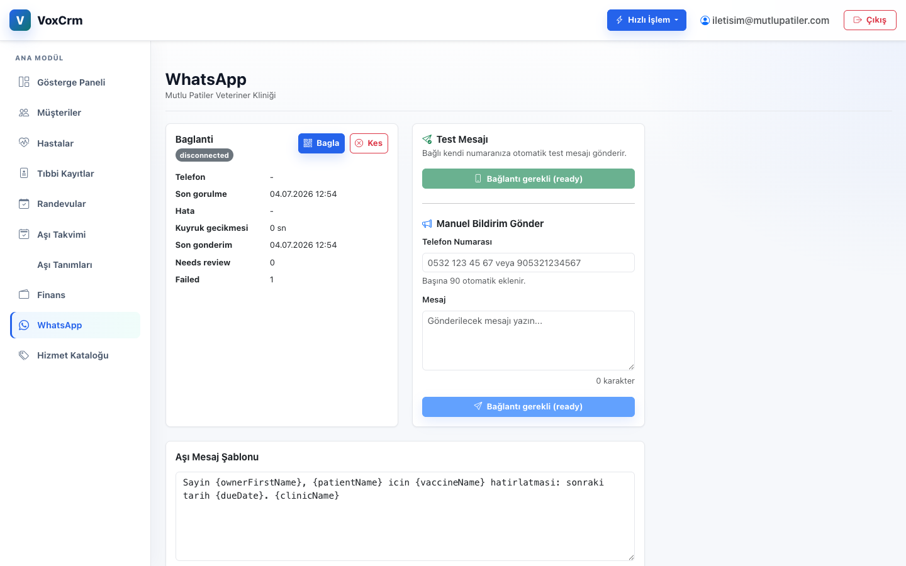
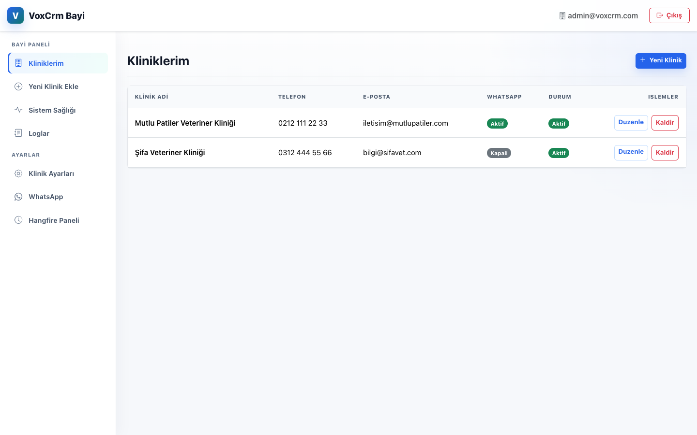

# VoxCRM - Veteriner Klinik Yönetim Sistemi

VoxCRM, veteriner klinikleri ve klinik ağlarını (bayiler) yönetmek için tasarlanmış, çok kiracılı (multi-tenant) bir CRM sistemidir. Hasta ve sahip yönetimi, randevu planlama, mali takip ve otomatik WhatsApp bildirimleri tek bir platformda bir araya getirilmiştir.

---

## Ekran Görüntüleri

**Giriş Sayfası**



**Gösterge Paneli**



**Müşteri Listesi**


**WhatsApp Entegrasyonu**



**Bayi Paneli**



---

## Sistem Mimarisi

Proje tek bir monorepo altında üç ana bölümden oluşuyor:

```
VoxCRM
├── VoxCrm.*         (C# / .NET 10) <-- Ana uygulama
├── whatsapp-gateway (Python + Node) <-- WhatsApp geçidi
└── backups/         (Bash + pg_dump) <-- Yedekleme klasörü
```

Servisler arası iletişim aşağıdaki gibi işler:

```
Tarayıcı
   |
   v
VoxCrm.Web (:5114)
   |   |
   |   +-- WhatsAppNotifications tablosuna kayıt ekler (Pending)
   |
   v
VoxCrm.Api (:5072)   <-- gateway-api buraya poll eder
   |
   +-- PostgreSQL (voxcrm_dev)
   |
   v
whatsapp-gateway/gateway-api (:8088)  [Python / FastAPI]
   |
   v
whatsapp-gateway/wa-worker (:8090)    [Node.js / Baileys]
   |
   v
WhatsApp (gerçek mesaj gönderiliyor)
```

Bildirim akışı kasıtlı olarak asenkroniktir: Web uygulaması doğrudan gateway'i çağırmaz. Mesaj önce `WhatsAppNotifications` tablosuna `Pending` durumuyla yazılır; gateway periyodik olarak bu tabloyu okur, kilitleme (SELECT FOR UPDATE SKIP LOCKED) yaparak mesajları işleme alır ve WhatsApp'a iletir.

---

## Klasör Yapısı ve Amacı

### VoxCrm.Domain/

**Amaç:** Uygulamanın çekirdek iş mantığı ve entity'leri burada tanımlıdır. Hiçbir dışarıya bağımlılık yoktur; sadece saf C# sınıflarından oluşur.

**İçerik:**
- `Entities/` — Tüm veritabanı entity'leri (`Clinic`, `PetOwner`, `Patient`, `Appointment`, `VaccinationRecord`, `WhatsAppNotification` vb.)
- `Common/` — Paylaşılan arayüzler (`ITenantEntity` gibi tenant izolasyonunu zorunlu kılan arayüzler)

**Kiminle konuşur:** Hiçbir servis katmanıyla doğrudan iletişime geçmez. Tüm diğer katmanlar Domain'e bağlıdır, Domain hiçbir katmana bağımlı değildir.

---

### VoxCrm.Application/

**Amaç:** CQRS (Command Query Responsibility Segregation) kalıbını hayata geçiren katman. Komutlar (yazma), sorgular (okuma) ve iş kuralları buradadır.

**Kiminle konuşur:** Sadece `VoxCrm.Domain` entity'lerini kullanır. Infrastructure ve Web katmanları tarafından çağrılır.

---

### VoxCrm.Infrastructure/

**Amaç:** Veritabanı erişimi, migration'lar ve zamanlanmış arka plan işleri burada yer alır.

**İçerik:**
- `Data/` — `VoxCrmDbContext` (Entity Framework Core), `DbSeeder` (başlangıç test verileri)
- `Migrations/` — PostgreSQL şema migration dosyaları
- `Jobs/` — `ReminderJob.cs`: Hangfire tarafından her gün tetiklenen aşı hatırlatma işlemi; son tarihi geçmiş `VaccinationRecord` kayıtları için `WhatsAppNotifications` tablosuna otomatik `Pending` kayıt oluşturur

**Kiminle konuşur:** `VoxCrm.Domain` entity'lerini kullanır. `VoxCrm.Web` ve `VoxCrm.Api` tarafından servis olarak inject edilir.

---

### VoxCrm.Web/

**Amaç:** Klinik ve bayi kullanıcıları için ASP.NET Core MVC web uygulaması. Bootstrap 5 ve Razor view'larla oluşturulmuş arayüz.

**İçerik:**
- `Controllers/` — 13 controller: Auth, Home, PetOwner, Patient, Appointment, Vaccination, Finance, WhatsApp, ServiceItem, VaccineType, Muayene, ClinicSettings, Dealer
- `Views/` — Razor sayfaları (her controller için ayrı klasör)
- `Services/` — HTTP istemcileri ve iş mantığı servisleri
- `wwwroot/` — Statik dosyalar (CSS, JS, görseller)

**Önemli güvenlik mekanizmaları:**
- `[Bind("Id,Alan1,Alan2")]` attribute'u ile Mass Assignment koruması
- `ModelState.Remove()` ile tenant ID'nin form gönderiminde manipüle edilmesi engellenir
- Global Query Filter'lar sayesinde her sorgu otomatik olarak o kliniğe ait verileri getirir (tenant izolasyonu)

**Kiminle konuşur:** PostgreSQL'e `VoxCrmDbContext` üzerinden erişir. `whatsapp-gateway/gateway-api`'ye JWT imzalı HTTP istekleri atar (bağlantı durumu, QR kodu). Hangfire panelini içerir.

---

### VoxCrm.Api/

**Amaç:** Yalnızca `whatsapp-gateway`'e açılan REST API. Tarayıcıya veya son kullanıcıya açık değildir. JWT (HS256, scope tabanlı) ile korunur.

**Endpoint'ler:**
- `POST /api/whatsapp/notifications/claim` — Gateway, işleme alacağı mesajları çeker (SELECT FOR UPDATE SKIP LOCKED)
- `POST /api/whatsapp/notifications/{id}/status` — Gateway, mesaj sonucunu bildirir
- `POST /api/whatsapp/notifications/recover-expired-processing` — Kilit süresi dolan mesajları kurtarır
- `POST /api/whatsapp/inbound` — WhatsApp'tan gelen mesajları kaydeder
- `GET /api/health` — Sağlık kontrolü

**Kiminle konuşur:** Sadece `whatsapp-gateway/gateway-api` bu API'yi çağırır. PostgreSQL'e `VoxCrmDbContext` üzerinden doğrudan erişir.

---

### VoxCrm.IntegrationTests/

**Amaç:** Uygulama genelinde entegrasyon testleri. API endpoint davranışları ve veritabanı katmanı burada test edilir.

---

### whatsapp-gateway/

**Amaç:** VoxCRM'den bağımsız çalışabilen, iki servisten oluşan WhatsApp geçidi.

#### whatsapp-gateway/gateway-api/ (Python / FastAPI)

**Görev:** Orkestrasyon servisi. VoxCrm.Api'yi poll eder, gönderim sıralamasını yönetir, klinik WhatsApp durumlarını takip eder, kimlik doğrulama ve sağlık endpoint'lerini sunar.

**Temel dosyalar:**
- `app/main.py` — API endpoint'leri, polling döngüsü, sağlık kontrolü
- `app/sender.py` — Klinik bazlı gönderim zamanlayıcı (per-clinic interval + jitter)
- `app/voxcrm_client.py` — VoxCrm.Api ile HTTP konuşması (claim, status)
- `app/worker_client.py` — wa-worker ile HTTP konuşması (send, status)
- `app/auth.py` — JWT üretimi ve doğrulaması
- `app/config.py` — `.env` dosyasından ortam değişkenleri
- `alembic/` — Gateway veritabanı migration'ları (PostgreSQL: `voxcrm_gateway_dev`)

#### whatsapp-gateway/wa-worker/ (Node.js / Baileys)

**Görev:** WhatsApp linked-device protokolünü yöneten iç servis. QR kod yaşam döngüsü, oturum şifreleme ve gerçek mesaj iletiminden sorumludur. İnternete doğrudan bu servis bağlanır; gateway-api ve VoxCrm.Web'e kapatılıdır.

**Temel dosyalar:**
- `src/baileysProvider.js` — Baileys kütüphanesi entegrasyonu, oturum yönetimi
- `src/sessionStore.js` — Klinik bazlı oturum saklama ve şifreleme
- `src/security.js` — İç token doğrulaması (gateway-api'den gelen istekleri doğrular)
- `src/app.js` — Express endpoint'leri (send, connect, disconnect, status, qr)

#### whatsapp-gateway/scripts/

**Görev:** Bakım ve yedekleme araçları.

- `backup.sh` — PostgreSQL dump, klinik bazlı JSON export, şifreli WhatsApp session arşivi ve SHA-256 manifest. Production hedefi `/var/backups/voxcrm/`; yerelde `BACKUP_ROOT` ile değiştirilebilir.
- `restore.sh` — Belirlenen backup snapshot'ını yerel veritabanına yükler (kasıtlı olarak interaktif; yanlışlıkla çalıştırılmaz)
- `test-all.sh` — .NET build + NuGet audit + pytest + Vitest + syntax check + backup smoke test'ini sırayla çalıştırır
- `test-backup-smoke.sh` — Gerçek veri silmeden backup script'ini test eder

#### whatsapp-gateway/.env.example

Çalıştırmak için kopyalanması gereken ortam değişkeni şablonu. Gerçek `.env` dosyası repoya girmez.

---

### backups/

**Amaç:** Yedekleme klasörü yapısı. Gerçek dump dosyaları `.gitignore` ile Git dışında tutulur; sadece klasör iskelet yapısı (`.gitkeep`) repoda yer alır.

```
/var/backups/voxcrm/
├── snapshots/ # 28 adet 6-saatlik snapshot (7 gün)
├── daily/     # 30 günlük snapshot
└── monthly/   # 12 aylık snapshot
```

**Her snapshot içeriği:**
- `voxcrm-db.dump` — Ana PostgreSQL veritabanı (pg_dump -Fc)
- `gateway-db.dump` — Gateway PostgreSQL veritabanı
- `clinic-{uuid}.json.gz` — Klinik bazlı okunabilir JSON export (hasta, sahip, randevu, mali kayıtlar, WhatsApp verileri)
- `whatsapp-sessions.tar.gz` — Baileys oturum dosyaları arşivi

---

### docs/screenshots/

**Amaç:** README içi uygulama ekran görüntüleri.

---

## Servisler Arası İlişki Haritası

```
+---------------------------+
|       Tarayıcı (UI)       |
+---------------------------+
            |
            v
+---------------------------+     +-------------------+
|      VoxCrm.Web           |---> | PostgreSQL        |
|  ASP.NET Core MVC :5114   |     | voxcrm_dev        |
+---------------------------+     +-------------------+
  |   ^                                   ^
  |   | (JWT HTTP)                        |
  v   |                                   |
+---------------------------+             |
|      VoxCrm.Api           |-------------+
|    REST API :5072          |
+---------------------------+
            ^
            | (JWT HTTP, polling)
            |
+---------------------------+     +-------------------+
|    gateway-api            |---> | PostgreSQL        |
|    FastAPI :8088           |     | voxcrm_gateway_dev|
+---------------------------+     +-------------------+
            |
            | (HTTP, iç token)
            v
+---------------------------+     +-------------------+
|      wa-worker            |---> | WhatsApp          |
|    Node.js :8090           |     | (Baileys)         |
+---------------------------+     +-------------------+
```

---

## Teknoloji Yığını

| Katman | Teknoloji |
|--------|-----------|
| Web Uygulaması | C# / .NET 10, ASP.NET Core MVC, Razor Pages |
| API | C# / .NET 10, ASP.NET Core Minimal API |
| ORM | Entity Framework Core 10, Code-First Migrations |
| Veritabanı | PostgreSQL 16 |
| Arka Plan İşleri | Hangfire (PostgreSQL storage) |
| WhatsApp Geçidi | Python / FastAPI, SQLAlchemy, Alembic (hash-kilitli) |
| WhatsApp İstemci | Node.js 22 / Baileys (linked-device) |
| Container | Docker Compose (geliştirme), OrbStack (yerel) |
| Ön Yüz | Bootstrap 5, jQuery, Vanilla CSS/JS |

---

## Kurulum ve Çalıştırma

### Ön Koşullar

- .NET 10 SDK
- Python 3.14 (production image bağımlılık lock'ı ile)
- Node.js 22
- PostgreSQL 16 (OrbStack veya Docker)
- Redis (gateway için)

### 1. Veritabanını Oluştur

```bash
docker start voxcrm-postgres voxcrm-redis
```

### 2. Ana Uygulamayı Başlat

```bash
# Bağlantı ayarlarını güncelle:
# VoxCrm.Web/appsettings.Development.json
# VoxCrm.Api/appsettings.Development.json

# Migration'ları uygula:
dotnet ef database update --project VoxCrm.Infrastructure --startup-project VoxCrm.Web

# API'yi başlat:
dotnet run --project VoxCrm.Api

# Web uygulamasını başlat:
dotnet run --project VoxCrm.Web
```

### 3. WhatsApp Gateway'i Başlat

```bash
cd whatsapp-gateway

# .env oluştur:
cp .env.example .env
# .env içindeki VOXCRM_API_BASE_URL değerini düzenle

# Docker ile (önerilen):
docker compose up -d gateway-api wa-worker

# Veya elle:
cd gateway-api
python3 -m venv .venv && . .venv/bin/activate
pip install -r requirements.txt
alembic -c alembic.ini upgrade head
uvicorn app.main:app --host 0.0.0.0 --port 8088 --reload

cd ../wa-worker
npm install
npm run dev
```

### 4. WhatsApp Bağlantısı

Tarayıcıda `VoxCrm.Web > WhatsApp` menüsünden kliniğe ait "Bağla" düğmesine tıklayarak QR kod taranır. QR kodunu wa-worker üretir, gateway-api aracılığıyla Web'e iletilir.

---

## Yedekleme

```bash
# Anahtarı repodan ve yedek diskinden ayrı saklayın (bir kez):
install -m 600 /dev/null ~/.voxcrm-backup.key
openssl rand -base64 48 > ~/.voxcrm-backup.key

# Günlük yedek al:
BACKUP_ENCRYPTION_KEY_FILE=~/.voxcrm-backup.key ./whatsapp-gateway/scripts/backup.sh

# Yedekler şu klasöre yazılır (BACKUP_ROOT ile değiştirilebilir):
# $HOME/Documents/Projeler/voxcrm-backups/snapshots/YYYYMMDDTHHMMSSZ/

# Geri yükle (dikkatli kullan, yerel veritabanını değiştirir):
BACKUP_ENCRYPTION_KEY_FILE=~/.voxcrm-backup.key \
  ./whatsapp-gateway/scripts/restore.sh "$HOME/Documents/Projeler/voxcrm-backups/snapshots/<timestamp>"
```

Yedekler AES-256 ile şifrelenir ve geri yükleme öncesi bütünlük manifesti doğrulanır.
Şifreli paketlerin ayrı kimlik bilgileri olan bir uzak depoya kopyalanması gerekir.

---

## Testler

```bash
# Tüm test süreci (build + NuGet + pytest + Vitest + backup smoke):
./whatsapp-gateway/scripts/test-all.sh

# Sadece .NET testleri:
dotnet test

# Sadece Gateway testleri:
cd whatsapp-gateway
. .venv/bin/activate
pytest gateway-api/tests/

# Sadece Worker testleri:
cd whatsapp-gateway/wa-worker
npm test
```

---

---

## Test kullanıcıları

Repoda veya README içinde çalışan parola bulunmaz. Geliştirme kullanıcılarını kendi
`appsettings.Development.json`/seeder ayarlarınızla oluşturun; production bootstrap
hesapları için yalnızca `deploy/production.env.example` içindeki placeholder'ları güçlü,
tek kullanımlık secret'larla değiştirin. İlk başarılı production girişinden sonra
bootstrap ayarlarını kapatın ve parolaları secret dosyasından kaldırın.

---

## Production teslim ve işletim rehberi

Bu bölüm, mevcut güvenlik ve production değişikliklerinin nerede olduğunu, nasıl
doğrulandığını ve sunucuya nasıl aktarılacağını anlatır. Ayrıntılı rollback ve runbook
için [docs/PRODUCTION_RUNBOOK.md](docs/PRODUCTION_RUNBOOK.md) esas alınır.

### Mevcut durum

Kod ve yerel production-preflight doğrulandı; canlı sunucuya deployment yapılmış değildir.
Canlıya çıkmadan önce salt-okunur sunucu envanteri, sunucu sertleştirmesi, DNS/TLS, gerçek
alarm kanalları, production restore ve rollback tatbikatı tamamlanmalıdır. Yedeklerin
yalnızca aynı VPS'te tutulması hâlâ kritik felaket kurtarma riskidir.

Son yerel doğrulama kaydı: 15 Temmuz 2026 — .NET 37/37, Python 12/12, Worker 15/15;
build 0 hata/0 uyarı; EF model pending değişikliği yok; NuGet/Python/npm audit temiz;
şifreli backup ve geçici DB restore başarılı; production image Trivy taramasında
High/Critical bulgu 0. Bu kayıt yerel ortam içindir; production sunucusu için aynı
kontroller release sonrasında tekrar edilir.

### Değişiklik haritası

| Konu | Nerede | Nasıl kontrol edilir |
|---|---|---|
| Tenant izolasyonu ve soft archive | `VoxCrm.Domain/Common`, `VoxCrm.Infrastructure/Data/VoxCrmDbContext.cs`, servis klasörleri | `SecurityRegressionTests`, `AppointmentIntegrationTests`, `ArchiveVaccinationIntegrationTests` |
| MFA, recovery code, zorunlu parola değişimi | `VoxCrm.Web/Controllers/AuthController.cs`, `VoxCrm.Web/Views/Auth`, `ApplicationUser` | İlk SystemAdmin/Dealer girişi; MFA kurulumu ve reset audit kaydı |
| AES-256-GCM PII | `VoxCrm.Infrastructure/Security`, EF interceptor ve migration'lar | PostgreSQL kolonları `enc:v1:` ile başlar; plaintext araması ve blind-index testi |
| WhatsApp şifreleme/idempotency/retry | `whatsapp-gateway/gateway-api/app`, `whatsapp-gateway/wa-worker/src` | Python pytest, Worker Vitest, restart/retry testleri |
| CSP ve XSS savunması | `VoxCrm.Web/Program.cs`, `TagHelpers`, `wwwroot/js/site.js` | Response CSP'de `unsafe-inline` bulunmamalı; nonce bulunmalı |
| Retention | `VoxCrm.Infrastructure/Jobs/DataRetentionJob.cs` | 30 günlük WhatsApp ve 365 günlük audit testi |
| Production container güvenliği | `deploy/docker-compose.prod.yml`, Dockerfile'lar | `docker compose config`, health-check, non-root/read-only/cap-drop incelemesi |
| Backup/restore/monitor | `deploy/scripts`, `deploy/systemd` | Backup smoke, checksum, geçici DB restore ve alarm testi |

### Çalışma ağacını ve değişiklikleri kontrol etme

```bash
cd /Users/ozhanyildirim/Documents/Projeler/VoxCrm
git status --short
git diff --check
git diff --stat
git diff -- README.md deploy/docker-compose.prod.yml
```

Release üretmeden önce çalışma ağacı temiz ve commit edilmiş olmalıdır. Secret, `.env`,
PII anahtarı, backup anahtarı, WhatsApp session veya `bin/obj` dosyaları commit edilmez.

### Yerel test kapısı

Tek komut bütün zorunlu kontrolleri çalıştırır:

```bash
cd /Users/ozhanyildirim/Documents/Projeler/VoxCrm
./whatsapp-gateway/scripts/test-all.sh
```

Bu komut .NET restore/build/test, EF pending-model kontrolü, NuGet transitive audit,
Python syntax/pytest, Node/Vitest, shell syntax ve gerçek şifreli backup-restore smoke
testini çalıştırır. Yerel Python sanal ortamı yoksa:

```bash
python3 -m venv /private/tmp/voxcrm-test-venv
/private/tmp/voxcrm-test-venv/bin/pip install --require-hashes \
  -r whatsapp-gateway/gateway-api/requirements.lock
/private/tmp/voxcrm-test-venv/bin/pip install pytest==9.1.1 pytest-asyncio==1.4.0
PYTHON_BIN=/private/tmp/voxcrm-test-venv/bin/python \
  ./whatsapp-gateway/scripts/test-all.sh
rm -rf /private/tmp/voxcrm-test-venv
```

Beklenen sonuç: .NET 37, Python 12 ve Worker 15 testin başarılı olmasıdır. Test sırasında
EF tools/runtime sürüm uyarısı görülebilir; `No changes have been made to the model`
çıktısı migration modelinin senkron olduğunu gösterir.

Elle seçili kontroller:

```bash
dotnet test VoxCrm.slnx
dotnet ef migrations has-pending-model-changes \
  --project VoxCrm.Infrastructure --startup-project VoxCrm.Web \
  --context VoxCrmDbContext
cd whatsapp-gateway/gateway-api && pytest
cd ../wa-worker && npm test
```

### Migration kontrolü

Yeni model değişikliğinde migration üretin, dosyaları inceleyin ve tekrar test edin:

```bash
dotnet ef migrations add <MigrationAdi> \
  --project VoxCrm.Infrastructure --startup-project VoxCrm.Web
dotnet ef migrations has-pending-model-changes \
  --project VoxCrm.Infrastructure --startup-project VoxCrm.Web \
  --context VoxCrmDbContext
```

Production'da migration doğrudan host'tan değil, Compose migration job'larından uygulanır.

### Yerel Compose preflight

Production Compose'u gerçek secret kullanmadan izole test etmek için geçici env ve PII key
kullanın. Bu dosyalar test sonrasında silinmelidir:

```bash
cp deploy/production.env.example /private/tmp/voxcrm-preflight.env
openssl rand -base64 32 > /private/tmp/voxcrm-preflight-pii.key
chmod 600 /private/tmp/voxcrm-preflight.env /private/tmp/voxcrm-preflight-pii.key
export VOXCRM_SECRETS_ENV=/private/tmp/voxcrm-preflight.env
export VOXCRM_PII_KEY_FILE=/private/tmp/voxcrm-preflight-pii.key
export VOXCRM_SESSION_DIR=/private/tmp/voxcrm-preflight-sessions

docker compose --project-name voxcrmpreflight \
  --env-file "$VOXCRM_SECRETS_ENV" -f deploy/docker-compose.prod.yml \
  build web api gateway-api wa-worker
docker compose --project-name voxcrmpreflight \
  --env-file "$VOXCRM_SECRETS_ENV" -f deploy/docker-compose.prod.yml \
  up -d --wait
docker compose --project-name voxcrmpreflight \
  --env-file "$VOXCRM_SECRETS_ENV" -f deploy/docker-compose.prod.yml ps -a
docker compose --project-name voxcrmpreflight \
  --env-file "$VOXCRM_SECRETS_ENV" -f deploy/docker-compose.prod.yml \
  down --volumes --remove-orphans
rm -f /private/tmp/voxcrm-preflight.env /private/tmp/voxcrm-preflight-pii.key
rm -rf /private/tmp/voxcrm-preflight-sessions
```

Preflight'te beklenen bootstrap kontrolü: boş DB, bir SystemAdmin, bir Dealer ve her iki
hesapta `MustChangePassword=true`; tüm servisler healthy olmalıdır.

### Production sunucu ön koşulları

Önce mevcut SSH bağlantısını doğrulayın; ardından yalnızca salt-okunur envanter alın:

```bash
ssh <kullanici>@<sunucu> 'bash -s' < deploy/scripts/server-inventory.sh \
  > server-inventory.txt
```

Deployment şu koşullarda durdurulur: Ubuntu 22.04/24.04 dışı işletim sistemi, 2 vCPU'dan
az, 4 GB RAM'den az, 80 GB SSD'den az, açıklanamayan public port/servis veya bekleyen
kritik OS güncellemesi. Envanter onaylanmadan SSH, UFW, Docker veya kullanıcı ayarı
değiştirilmez.

Bu VPS'te kullanıcı talebiyle SSH tamamen kapsam dışıdır: port, root/parola girişi,
authorized_keys ve SSH yapılandırması değiştirilmez. Sunucu birden fazla aktif site
barındırdığı için Nginx, Apache, Docker daemon, PM2, UFW ve global ağ ayarları bakım
penceresi ve mevcut site baseline karşılaştırması olmadan değiştirilmez. Envanter sonucu
`docs/SERVER_INVENTORY_2026-07-15.md` dosyasındadır.

### Secret oluşturma

Secretlar release arşivine, Git'e veya Docker image'a konmaz:

```bash
sudo install -d -o voxcrm -g voxcrm -m 700 /etc/voxcrm/secrets
sudo cp deploy/production.env.example /etc/voxcrm/secrets/production.env
sudo openssl rand -base64 32 | sudo tee /etc/voxcrm/secrets/pii.key >/dev/null
sudo openssl rand -base64 48 | sudo tee /etc/voxcrm/secrets/backup.key >/dev/null
sudo chmod 600 /etc/voxcrm/secrets/*
sudoedit /etc/voxcrm/secrets/production.env

# PII key yalnız sabit non-root container UID'si tarafından salt okunabilir.
# Hostta UID 1654 başka bir kullanıcıya ait olmamalıdır. Bu komut çıktı verirse durun.
getent passwd 1654
sudo apt-get install -y --no-install-recommends acl
sudo setfacl -m u:1654:r /etc/voxcrm/secrets/pii.key
sudo getfacl -p /etc/voxcrm/secrets/pii.key
```

`POSTGRES_PASSWORD`, JWT secret, worker token, session encryption key, bootstrap
parolaları ve `ACME_EMAIL` placeholder olmamalıdır. PII ve backup anahtarları birbirinden
ve DB parolasından farklı tutulur. Anahtar kaybı şifreli verinin geri döndürülememesi
anlamına gelir; ayrı, erişim kontrollü bir recovery kopyası planlanmalıdır. PII anahtarı
ACL çıktısında yalnız owner `voxcrm`, `user:1654:r--` ve `other::---` göstermelidir;
UID 1654 hem .NET hem gateway imajlarında sabitlenmiştir. Hostta bu UID sonradan başka
bir kullanıcıya atanamaz.

### Release üretme ve sunucuya aktarma

Release yalnız testleri geçen temiz commit'ten üretilir:

```bash
git status --short                 # boş olmalı
git add -A
git commit -m "release: <versiyon>"
deploy/scripts/release.sh <versiyon>
```

Oluşan iki dosya `artifacts/releases/voxcrm-<versiyon>.tar.gz` ve `.sha256`'dır. Aktarım
ve sunucu doğrulaması:

```bash
scp artifacts/releases/voxcrm-<versiyon>.tar.gz \
    artifacts/releases/voxcrm-<versiyon>.tar.gz.sha256 \
    <kullanici>@<sunucu>:/opt/voxcrm/incoming/
ssh <kullanici>@<sunucu> 'cd /opt/voxcrm/incoming && sha256sum -c voxcrm-<versiyon>.tar.gz.sha256'
```

Checksum doğrulanmadan arşiv açılmaz. Release içeriği secret taşımaz ve container build
kullanıcılarının dosyaları okuyabilmesi gerekir; secret oluştururken kullanılan `umask 077`
ile arşiv açılmamalıdır. Sunucuda şu şekilde çıkarılır ve PostgreSQL init dosyası ayrıca
doğrulanır:

```bash
install -d -o voxcrm -g voxcrm -m 755 /opt/voxcrm/releases/<versiyon>
(umask 022; tar -xzf /opt/voxcrm/incoming/voxcrm-<versiyon>.tar.gz \
  -C /opt/voxcrm/releases/<versiyon> --strip-components=1)
test "$(stat -c '%a' /opt/voxcrm/releases/<versiyon>/deploy/postgres/init.sql)" = 644
```

Arşiv `/opt/voxcrm/releases/<versiyon>` dizinine açılır ve `current` symlink'i yalnız
readiness/smoke sonrası değiştirilir. Sunucu mimarisi
(amd64/arm64) envanterde doğrulanmadan yerel image aktarımı yapılmaz; gerekirse image'lar
sunucuda yeniden build edilir.

### Production deployment sırası

```bash
cd /opt/voxcrm/current
sudo -u voxcrm ./deploy/scripts/backup-production.sh

docker compose --env-file /etc/voxcrm/secrets/production.env \
  -f deploy/docker-compose.prod.yml run --rm migrate-crm
docker compose --env-file /etc/voxcrm/secrets/production.env \
  -f deploy/docker-compose.prod.yml run --rm migrate-gateway
docker compose --env-file /etc/voxcrm/secrets/production.env \
  -f deploy/docker-compose.prod.yml up -d --no-build --wait \
  web api gateway-api wa-worker
curl -fsS http://127.0.0.1:5180/healthz
./deploy/scripts/verify-production.sh
```

Bu sunucuda Caddy başlatılmaz; 80/443 mevcut Nginx tarafından kullanılmaktadır. VoxCrm
yalnız `127.0.0.1:5180` adresinde dinler. Önce origin health/smoke yapılır, ardından
`deploy/nginx/petcrm.fenrirsoftware.com.conf` kurulur. `nginx -t` başarılı olmadan
graceful reload yapılmaz; öncesi/sonrası mevcut sitelerin HTTP durum kodları
karşılaştırılır. DNS yönlendirmesinden sonra Certbot Nginx sertifikasını üretir ve
TLS/HSTS doğrulanır. İlk giriş sırası:
SystemAdmin → Dealer → tek klinik. İlk başarılı girişlerden sonra
`DataSeeding__SystemAdmin__Enabled` ve `DataSeeding__ProductionDealer__Enabled` false
yapılır; bootstrap parolaları secret dosyasından silinir ve servisler yeniden oluşturulur.

### Backup, bütünlük ve restore

Backup kapsamı CRM PostgreSQL, gateway PostgreSQL ve şifreli WhatsApp session dizinidir.
Saklama politikası 28 adet 6-saatlik snapshot (7 gün), 30 günlük kopya ve 12 aylık aylık
kopyadır. Paket AES-256 ile şifrelenir ve iç/dış SHA-256 manifest taşır.

```bash
sudo systemctl enable --now voxcrm-backup.timer voxcrm-monitor.timer
sudo systemctl start voxcrm-backup.service
sudo -u voxcrm ./deploy/scripts/verify-latest-backup.sh
```

Restore geri döndürülemez bir işlemdir; önce pre-deploy snapshot ve iki kişi onayı alınır.
Yerel restore için:

```bash
BACKUP_ENCRYPTION_KEY_FILE=/etc/voxcrm/secrets/backup.key \
  ./whatsapp-gateway/scripts/restore.sh /var/backups/voxcrm/snapshots/<timestamp>
```

Script checksum ve şifre çözme doğrulamasından sonra interaktif olarak `RESTORE` kelimesini
ister. Aylık tatbikat production DB yerine geçici iki PostgreSQL DB'ye yapılır; başarı ve
RTO kayda geçirilir. Off-site immutable kopya yoksa VPS kaybında geri dönüş garanti değildir.

### Rollback

Readiness veya smoke testi başarısızsa DNS açılmaz. `current` symlink'i önceki release'e
döndürülür ve eski image'lar `--no-build` ile başlatılır. Migration geriye uyumlu değilse
servisler durdurulur; yalnızca doğrulanmış pre-deploy snapshot iki kişi onayıyla restore
edilir. Rollback tatbikatı production kabul formunda işaretlenmeden go-live tamamlanmaz.

### Alarm ve izleme

`voxcrm-monitor.timer` her 5 dakikada HTTPS health, disk (%75/%85), son login hataları ve
lockout'ları, migration/retention hatalarını, WhatsApp retry/`NeedsReview` sayılarını ve
queue gecikmesini kontrol eder. `voxcrm-backup.timer` 6 saatte bir çalışır. Telegram için
`TELEGRAM_BOT_TOKEN`/`TELEGRAM_CHAT_ID`, e-posta için `ALERT_EMAIL_TO` doldurulur ve gerçek
test mesajı doğrulanır.

```bash
sudo systemctl status voxcrm-monitor.timer voxcrm-backup.timer
journalctl -u voxcrm-monitor.service -n 100 --no-pager
journalctl -u voxcrm-backup.service -n 100 --no-pager
```

### Güvenlik ve production kabul kapıları

Go-live öncesi aşağıdakilerin tamamı kanıtla kapatılır:

- 64/64 otomatik test, EF pending-model kapısı ve dependency audit başarılı.
- Tenantlar arası ID/list/socket/gateway/WhatsApp erişimi reddediliyor.
- SystemAdmin ve Dealer MFA, recovery code ve reset audit testi başarılı.
- Şifreli kolonlarda plaintext yok; blind-index araması tenant ile sınırlı.
- CSP'de `unsafe-inline` yok; XSS, CSRF, open redirect, body limit ve rate-limit testleri başarılı.
- Eşzamanlı randevu çakışması engelleniyor; arşivleme/geri alma çalışıyor.
- Sahipsiz hayvan ve kimliği belirsiz kişi minimum bilgiyle kaydedilebiliyor.
- Backup checksum, gerçek restore ve rollback tatbikatı başarılı.
- TLS/HSTS, açık port, varsayılan/demo parola, gerçek alarm kanalları ve ZAP baseline doğrulandı.
- İlk 48 saat yalnız yönetici/dealer/tek klinik ile gözlem tamamlandı.

### Sorun giderme

```bash
docker compose --env-file /etc/voxcrm/secrets/production.env \
  -f deploy/docker-compose.prod.yml ps -a
docker compose --env-file /etc/voxcrm/secrets/production.env \
  -f deploy/docker-compose.prod.yml logs --tail=200 web api gateway-api wa-worker
curl -fsS https://petcrm.fenrirsoftware.com/healthz
curl -fsSI https://petcrm.fenrirsoftware.com/Auth/Login
```

`web`/`api` health başarısızsa önce PostgreSQL ve migration job durumunu; gateway health
başarısızsa gateway migration, worker health ve `/app/sessions` izinlerini kontrol edin.
WhatsApp mesajı `NeedsReview` durumuna düşerse aynı mesajı körlemesine yeniden göndermek
yerine gateway audit kaydını ve retry sayısını inceleyin.

### Bu dokümanın güncellenmesi

Her migration, secret değişikliği, yeni container image, retention değişikliği veya rollback
tatbikatından sonra bu README ve [PRODUCTION_RUNBOOK.md](docs/PRODUCTION_RUNBOOK.md)
aynı commit içinde güncellenir. Release notuna test çıktısı, image digest, migration listesi,
backup/restore sonucu ve kalan riskler eklenir.
